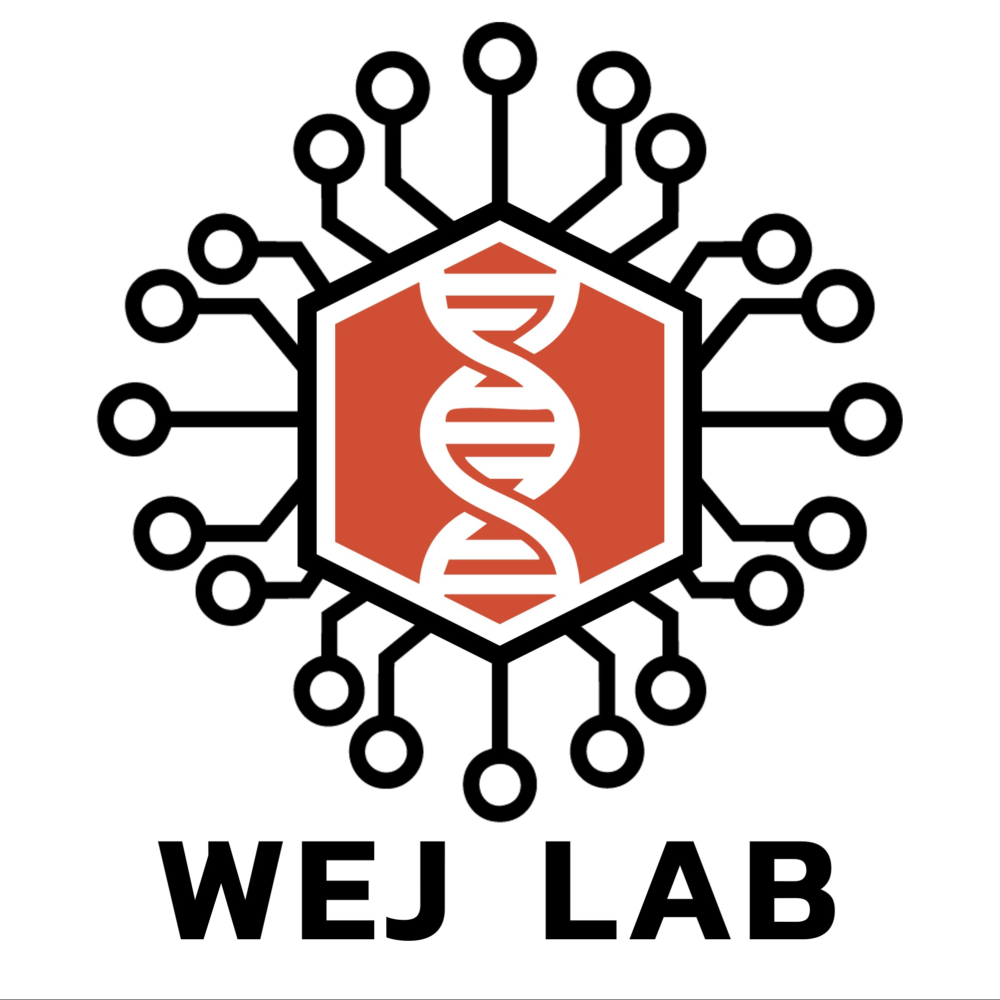

<!--  -->

# Welcome to the Johnson Lab Software Page

Check out the Johnson Lab Homepage: [https://www.wejlab.org](https://www.wejlab.org)

## GitHub Links
Our lab's software projects can be found at the following GitHub repositories: 
* [WEJ Lab GitHub Repository](https://github.com/wejlab/)
* [Evan Johnson's Personal GitHub Repository](https://github.com/wevanjohnson)

## Some of our most popular projects: 

__Combining Multiple Batches of -omic Data__(_ComBat, Combat-Seq, BatchQC_): Our tools for batch correction are highly cited, widely-used, and commonly downloaded (107,477 package downloads in 2020; top 3% of all packages in R/Bioconductor).
* <ins>ComBat</ins> is a software for reducing batch effects when combining genomic data from different labs, experiments, or hybridization batches, or technology platforms. It utilizes an empirical Bayesian linear modeling approach to robustly account for technical variability across multiple high-thoughput studies. ComBat is available within the sva package. [Bioconductor sva package](https://bioconductor.org/packages/sva) / [Publication](https://academic.oup.com/biostatistics/article/8/1/118/252073) / [GitHub  sva](https://github.com/jtleek/sva-devel)
* <ins>ComBat-Seq</ins> uses a Negative Binomial error model to extend ComBat to sequencing-based experiments and is available in the sva package. [Bioconductor sva package](https://bioconductor.org/packages/sva) / [Publication](https://pubmed.ncbi.nlm.nih.gov/33015620/) / [GitHub sva](https://github.com/jtleek/sva-devel)
* <ins>BatchQC</ins> is a user-interface for interactive evaluation of batch effects in -omic data. [Bioconductor](https://bioconductor.org/packages/release/bioc/html/BatchQC.html) / [Publication](https://academic.oup.com/bioinformatics/article/32/24/3836/2525651) / [GitHub](https://github.com/wejlab/BatchQC)
* _These tools are highly cited, widely-used, and commonly downloaded (107,477 package downloads in 2020; top 3% of all packages in R/Bioconductor)._  
	
 __Metagenomic profiling and multi-sample analysis__ (_PathoScope, MetaScope, animalcules, LegATo_):
* <ins>PathoScope 2.0</ins> is a complete bioinformatics framework for the metagenomic analysis of data from clinical or environmental sequencing samples. PathoScope includes modules for reference genome library extraction and indexing, read quality control and alignment, strain identification, and annotation of results. [PathoScope 2.0 Wiki](https://sourceforge.net/p/pathoscope/wiki/Home/) / [Publication](https://microbiomejournal.biomedcentral.com/articles/10.1186/2049-2618-2-33) / [GitHub](https://github.com/PathoScope/PathoScope)
* <ins>animalcules</ins> is an R package for processing multi-sample metagenomic data and is specially designed for integration with PathoScope and MetaScope outputs with flexibility for other 16S and meta-omics pipeline outputs. The package provides an easy-to-use interactive microbiome analysis framework as a standalone software package or an interactive R Shiny application. [animalcules docs](https://wejlab.github.io/animalcules-docs/) / [Bioconductor](https://bioconductor.org/packages/release/bioc/html/animalcules.html) / [Publication](https://microbiomejournal.biomedcentral.com/articles/10.1186/s40168-021-01013-0) / [GitHub](https://github.com/wejlab/animalcules)
* <ins>MetaScope</ins> is an R-based 16S, metagenomic, and metatranscriptomic profiling package that can accurately identify the composition of microbes at a strain-level resolution within a sample. MetaScope can be considered as a highly updated and expanded R translation of PathoScope 2.0. [MetaScope docs](https://wejlab.github.io/metascope-docs/) / [Bioconductor](https://bioconductor.org/packages/release/data/experiment/html/MetaScope.html) / [GitHub](https://github.com/wejlab/MetaScope/)
* <ins>LegATo</ins> is an R package suite of open-source software tools for longitudinal microbiome analysis. It integrates visualization, modeling and testing procedures extendable to several different study forms with optimal ease-of-use for researchers. [LegATo docs](https://wejlab.github.io/LegATo-docs/index.html) / [GitHub](https://github.com/wejlab/LegATo)
	
__Signature scoring, curation, and validation in TB research__ (_TBSignatureProfiler, curatedTBData, ASSIGN_):
* <ins>The TBSignatureProfiler R package</ins> enables analysis of RNA-seq data using 70+ included gene signatures for tuberculosis disease presence, risk, progression, treatment failure, and other states. In-package signature profiling is available using common gene set enrichment tools that include GSVA, singscore, and ssGSEA. [TBSignatureProfiler docs](https://wejlab.github.io/TBSignatureProfiler-docs/) / [Bioconductor](https://www.bioconductor.org/packages/TBSignatureProfiler) / [Publication](https://bmcinfectdis.biomedcentral.com/articles/10.1186/s12879-020-05598-z) / [GitHub](https://github.com/compbiomed/TBSignatureProfiler/)
* <ins>The curatedTBData R package</ins> is an effort to compile and harmonize data from more than 49 datasets with more than 4,000 samples. The curatedTBData can be combined with the TBSignatureProfiler to generate or validate new signatures, evaluate existing signatures on subsets or to provide data for other projects. [Bioconductor](https://bioconductor.org/packages/release/data/experiment/html/curatedTBData.html) / [Publication](https://www.biorxiv.org/content/10.1101/2023.12.01.569442v1) / [Github](https://github.com/wejlab/curatedTBData)
* <ins>ASSIGN</ins> utilizes Bayesian factor regression model to identify genomic biomarkers for applications in pathway profiling, drug responsiveness, environmental exposure, and infectious disease diagnosis. [Bioconductor](https://bioconductor.org/packages/release/bioc/html/ASSIGN.html) / [Publication](https://www.ncbi.nlm.nih.gov/pmc/articles/PMC4443674/) / [GitHub](https://github.com/wejlab/ASSIGN)

__Tools and Workflows for Single Cell RNA-seq Analysis.__ (_singleCellTK_): 
* <ins>The singleCellTK</ins> is an NCI-funded project to construct a comprehensive and interactive R-software framework for complete data processing and analysis of single cell RNA-sequencing data from heterogeneous tumor samples. We have developed the singleCellTK with an R/Shiny user interface that enables interactive analysis and visualization in the data.
	
__Single and Multi-Channel Array Normalization and barcoding__ (_SCAN-UPC, MAT, MA2C_): 
* <ins>SCAN</ins> is a microarray normalization method that removes background noise using only data from within each array individually, therefore facilitating applications in precision medicine.
* <ins>UPC</ins> utilizes a similar modeling approach to produce barcodes that estimate gene activity in data from microarray and RNA-sequencing platforms.
* <ins>MAT</ins> is designed for the analysis of data from Affymetrix tiling microarrays. The MA2C software is a similar approach but designed to analyze data from two-color tiling arrays.
	
__Genomic Next-generation Universal Mapper__ (_GNUMAP_): 
* <ins>GUNUMAP</ins> is a software suite for aligning next sequencing data from DNA-seq, BS-seq, and RNA-seq (including small RNAs, RNA editing) experiments. It uses a highly accurate probabilistic alignment approach that incorporates base uncertainty into the alignment algorithm.

